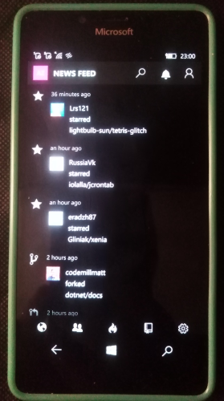
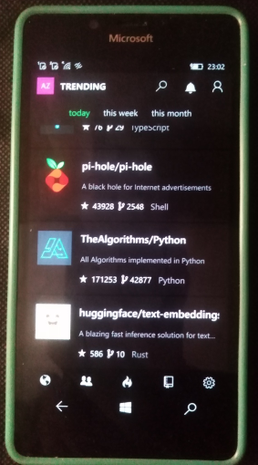

# CodeHub

CodeHub is a Universal Windows GitHub client that helps you keep up with the open source world.

## About this fork
This fork is aimed at supporting Windows 10 Mobile devices from version 15063. 
Please not that I als used another fork: https://github.com/RetroHunGamer/CodeHub

## Features
* Trending repositories
* News Feed
* View code (with syntax highlighting), issues and comments. 
* Create Issues
* Comment on Issues and PRs
* Choose from 9 different syntax highlighting styles
* Search repositories, users, issues and code
* Star, Watch and Fork repositories
* Follow users

## Screenshot(s)

## My "2 cents"
* RnD of CodeHub; exploring very specific "Edge Auth interceptor" :)
* Min. Win OS SDK : 15063
 
## Setting up the project 
* [Register](https://github.com/settings/developers) your OAuth application. Use "https://example.com/path" as callback url. 
*  After app registation, paste generated key and secret in the `app.config` file in the root of the project.

## Credits / Reference
- https://github.com/aalok05 Aalok Singh aka aalok05
- https://github.com/RetroHunGamer RetroHunGamer
- https://github.com/aalok05/CodeHub Original CodeHub app for desktop os (16299)
- https://github.com/RetroHunGamer/CodeHub CodeHub's fork for mobile os (14393)

## ..
As is. No support. RnD only. DIY

##
[m][e] 2023 

